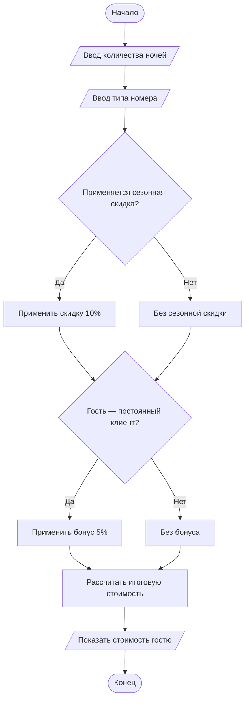

# Flowchart — Расчёт стоимости бронирования

Блок-схема алгоритма расчёта итоговой стоимости бронирования номера в отеле.

```mermaid
flowchart TD
    A([Начало]) --> B[/Ввод количества ночей/]
    B --> C[/Ввод типа номера/]
    C --> D{Применяется сезонная скидка?}
    D -->|Да| E[Применить скидку 10%]
    D -->|Нет| F[Без сезонной скидки]
    E --> G{Гость — постоянный клиент?}
    F --> G
    G -->|Да| H[Применить бонус 5%]
    G -->|Нет| I[Без бонуса]
    H --> J[Рассчитать итоговую стоимость]
    I --> J
    J --> K[/Показать стоимость гостю/]
    K --> L([Конец])
```