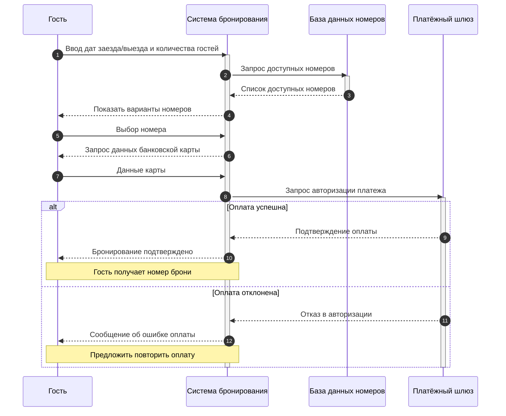

# Sequence Diagram — Бронирование номера в отеле

Сценарий: успешное бронирование номера с оплатой банковской картой.

```mermaid
sequenceDiagram
    autonumber
    participant Г as Гость
    participant С as Система бронирования
    participant БД as База данных номеров
    participant П as Платёжный шлюз

    Г->>С: Ввод дат заезда/выезда и количества гостей
    activate С
    С->>БД: Запрос доступных номеров
    activate БД
    БД-->>С: Список доступных номеров
    deactivate БД
    С-->>Г: Показать варианты номеров
    Г->>С: Выбор номера
    С-->>Г: Запрос данных банковской карты
    Г->>С: Данные карты
    С->>П: Запрос авторизации платежа
    activate П

    alt Оплата успешна
        П-->>С: Подтверждение оплаты
        С-->>Г: Бронирование подтверждено
        Note over Г,С: Гость получает номер брони
    else Оплата отклонена
        П-->>С: Отказ в авторизации
        С-->>Г: Сообщение об ошибке оплаты
        Note over Г,С: Предложить повторить оплату
    end

    deactivate П
    deactivate С
```