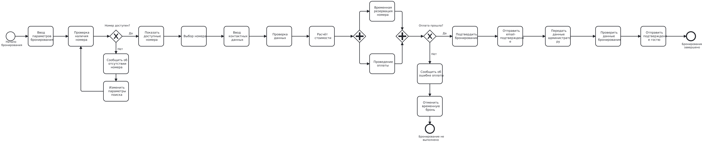
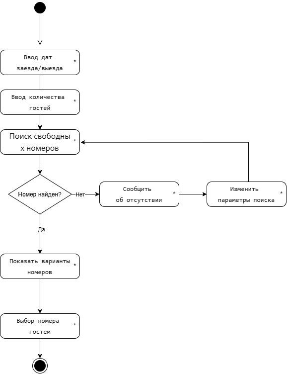
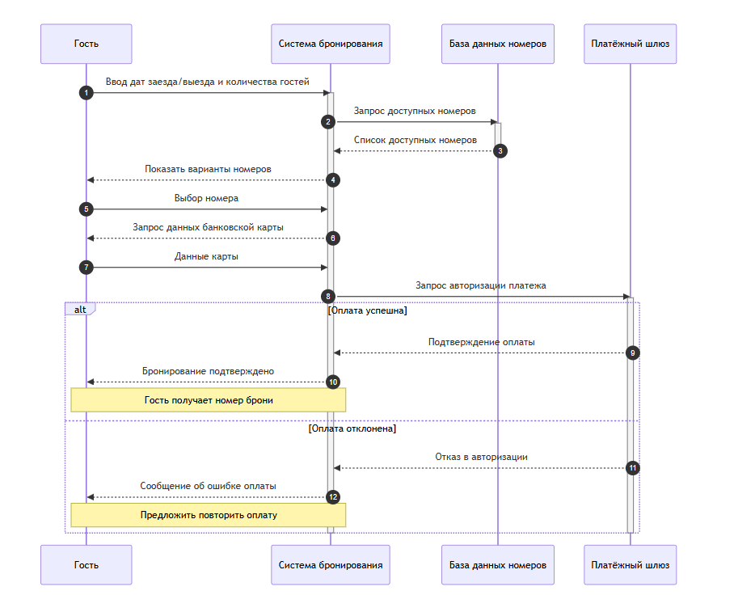
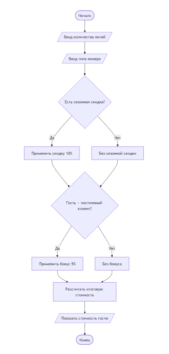
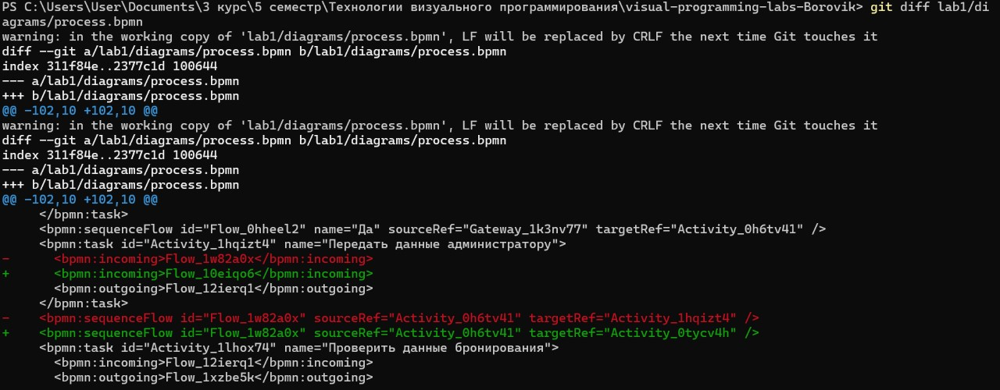
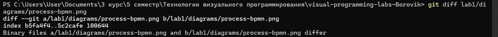
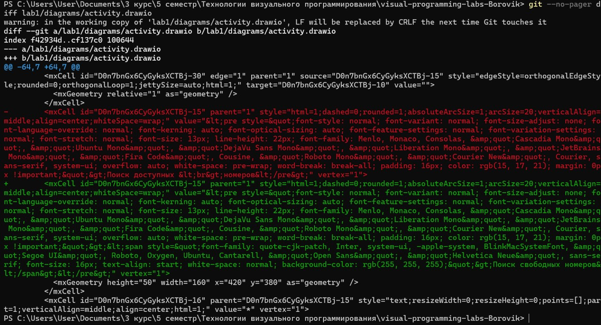
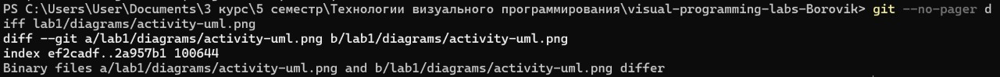
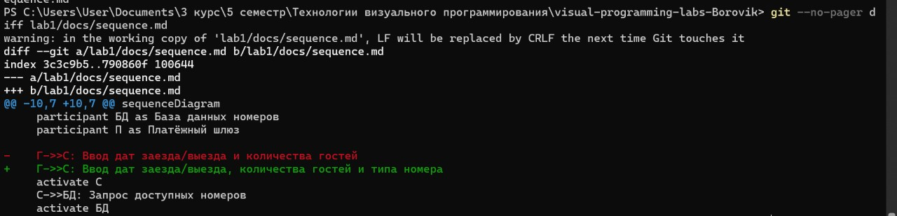
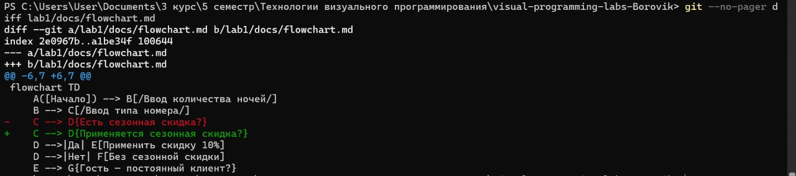

## 1. Описание процесса

Процесс «Бронирование номера в отеле» описывает взаимодействие гостя 
с системой бронирования, администратором отеля и платёжной системой. 
Гость вводит даты заезда и выезда, количество гостей и категорию номера, 
после чего система проверяет наличие свободных номеров. Если номер найден, 
гость выбирает его, вводит контактные данные, и система рассчитывает 
итоговую стоимость. Параллельно система временно резервирует номер, а 
платёжная система проверяет оплату: при успехе бронь подтверждается, при 
отказе — временная бронь отменяется и гость может повторить оплату. 
Администратор отеля получает информацию о подтверждённой брони и 
использует её для заселения гостя.

## 2. Диаграммы

### 2.1. BPMN-диаграмма

BPMN-диаграмма процесса бронирования. Содержит стартовое событие, 
несколько задач, шлюзы (XOR для проверки наличия номера, AND для 
параллельной резервации и оплаты) и конечное событие.

### 2.2. UML Activity Diagram

UML Activity детализирует шаг «Проверка наличия номера». Содержит 
начальный узел, действия по вводу параметров и поиску, решение 
«Номер найден?», цикл возврата при отсутствии номера и конечный узел.

### 2.3. Sequence Diagram

Sequence Diagram показывает обмен сообщениями между четырьмя 
участниками: Гостем, Системой бронирования, Базой данных номеров 
и Платёжным шлюзом. Содержит блок alt для случаев успешной и 
неуспешной оплаты.

### 2.4. Flowchart

Flowchart описывает алгоритм расчёта итоговой стоимости бронирования. 
Содержит два условия (сезонная скидка, статус постоянного клиента) 
и расчёт итоговой стоимости.

## 3. Diff для текстовых и бинарных форматов

Я внесла изменения в 4 исходных файла и сравнила, как Git отображает 
diff для текстовых и бинарных форматов.

### 3.1. Diff для process.bpmn (текстовый XML)

Видно конкретные строки XML — какие элементы добавились, какие связи 
изменились.

### 3.2. Diff для process-bpmn.png (бинарный)

Git вывел только «Binary files differ» — без деталей.

### 3.3. Diff для activity.drawio (текстовый XML)

Также видны конкретные строки XML.

### 3.4. Diff для activity-uml.png (бинарный)

«Binary files differ» — без деталей.

### 3.5. Diff для sequence.md (Mermaid)

Видно, что Git показал построчные изменения — каждое слово. 
Это демонстрирует удобство текстового формата Mermaid.

### 3.6. Diff для flowchart.md (Mermaid)

Аналогично — построчный diff. Mermaid-файлы отлично 
сравниваются, потому что это чистый текст.

## 4. Выводы

В ходе лабораторной работы я научилась работать с Git: добавлять файлы, 
делать коммиты, отправлять изменения на GitHub и смотреть историю. 
Отдельно разобралась с `git diff` — увидела, что для текстовых файлов 
(`.bpmn`, `.md`) Git показывает конкретные изменённые строки, а для 
бинарных (`.png`) — только сообщение «Binary files differ». Это помогло 
понять, почему исходники диаграмм лучше хранить в текстовом формате.

Я также освоила четыре нотации: BPMN, UML Activity, Sequence и Flowchart. 
BPMN удобен для описания процессов с ролями и шлюзами, Mermaid — для 
быстрого создания диаграмм прямо в Markdown.

Главный вывод: текстовые форматы удобнее для версионирования, а Git — 
мощный инструмент, который пригодится в дальнейшей работе.