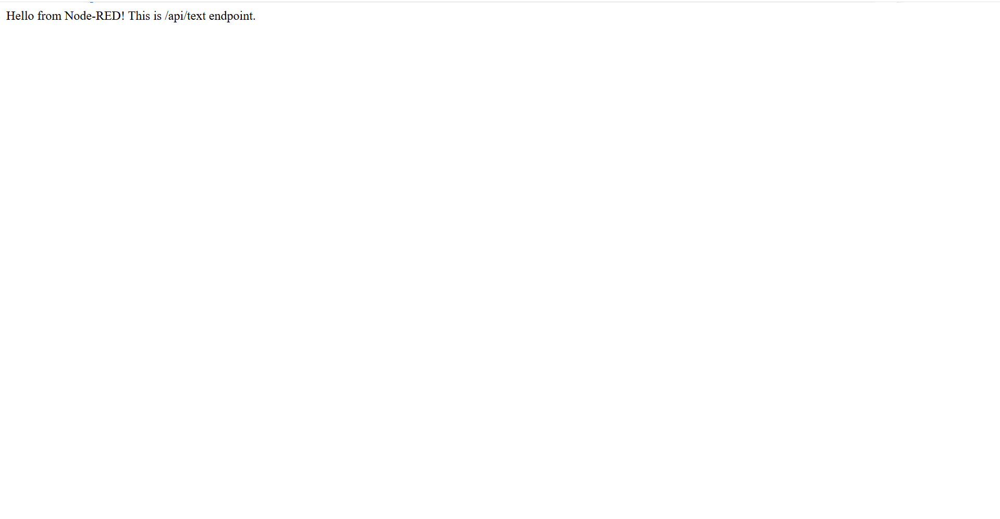
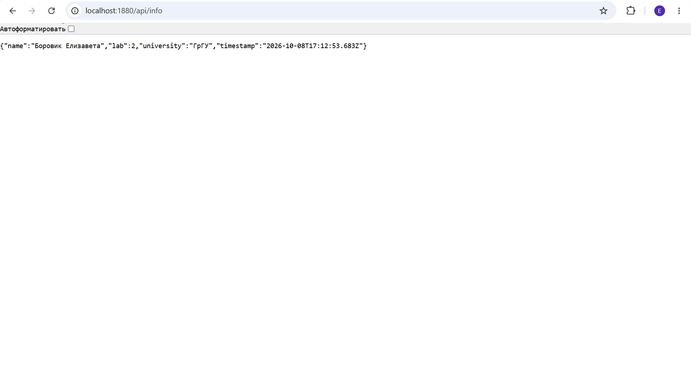
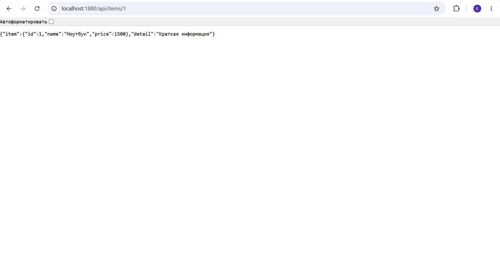
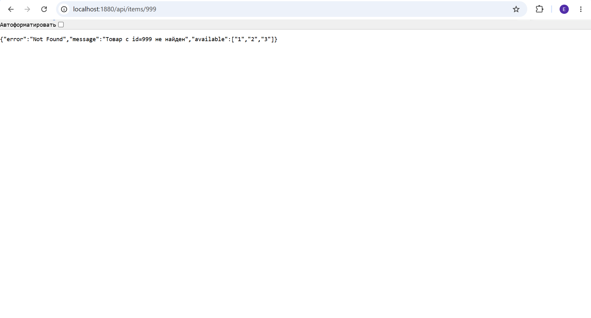

# API Documentation — Лабораторная работа №2 (Node-RED)

**Базовый URL:** http://localhost:1880

## 1. GET /api/text

Возвращает простой текст.

Запрос:
GET http://localhost:1880/api/text

Ответ — 200 OK:
Hello from Node-RED! This is /api/text endpoint.

Скриншот:

## 2. GET /api/info

Возвращает JSON с информацией о студенте.

Запрос:
GET http://localhost:1880/api/info

Ответ — 200 OK:
{"name": "Боровик Елизавета", "lab": 2, "university": "ГрГУ", "timestamp": "2026-10-08T17:12:53.683Z"}

Поля ответа:
- name — ФИО студента
- lab — номер лабораторной работы
- university — название университета
- timestamp — время формирования ответа (ISO 8601)

Скриншот:

## 3. GET /api/items/:id

Возвращает информацию о товаре. Использует path parameter `id` и query parameter `detail`.

Параметры:
- id (path, обязательный) — ID товара: 1, 2 или 3
- detail (query, необязательный) — если `full`, вернуть полную информацию

Доступные товары:
- ID 1 — Ноутбук — 1500
- ID 2 — Мышь — 25
- ID 3 — Клавиатура — 75

Успешный запрос — 200 OK:
GET http://localhost:1880/api/items/1
Ответ:
{"item": {"id": 1, "name": "Ноутбук", "price": 1500}, "detail": "Краткая информация"}

Скриншот:

Запрос с query-параметром — 200 OK:
GET http://localhost:1880/api/items/2?detail=full
Ответ:
{"item": {"id": 2, "name": "Мышь", "price": 25}, "detail": "Полная информация"}

Ошибка 404 — товар не найден:
GET http://localhost:1880/api/items/999
Ответ:
{"error": "Not Found", "message": "Товар с id=999 не найден", "available": ["1", "2", "3"]}

Скриншот:

Ошибка 400 — неверный id:
GET http://localhost:1880/api/items/abc
Ответ:
{"error": "Bad Request", "message": "Параметр id должен быть числом", "example": "/api/items/1"}

Сводная таблица кодов:
200 — OK — товар найден
400 — Bad Request — id не является числом
404 — Not Found — товар с таким id не найден

Реализация статус-кодов:
Для эндпоинта /api/items/:id используется switch node, который направляет сообщение на один из трёх http response с кодами 200, 400, 404 в зависимости от msg.statusCode.