# Отчёт по лабораторной работе №2 (Node-RED)

## 1. Краткое описание выполненного

В рамках лабораторной работы №2 был освоен Node-RED как low-code инструмент визуального программирования. Выполнены следующие задачи:

- Установлен и запущен Node-RED в Docker-контейнере с volume для сохранения данных.
- Собраны и задеплоены 12 потоков (flow), охватывающих базовые и расширенные ноды Node-RED.
- Создана документация API (`docs/api.md`).
- Все потоки сохранены в виде JSON-файлов, сделаны скриншоты.
- Работа зафиксирована в Git с осмысленными коммитами.

## 2. Использованные AI-промпты

AI (ChatGPT) использовался для генерации кода и объяснений. Ключевые промпты:

### Промпт 1. Function node для потока 2.2

> Сгенерируй код для Node-RED function node на JavaScript, который использует let/const, if/else, цикл for, массив и объект. Функция возвращает объект с полем payload.

**Результат:** сгенерирован код, который суммирует массив, формирует объект с полями `sum`, `count`, `status`, `timestamp`.

### Промпт 2. Mustache-шаблон для потока 2.5

> Создай Mustache-шаблон для Node-RED, который принимает объект с полями name, age, city и формирует JSON с полями student, age, city, greeting.

**Результат:** сгенерирован шаблон с подстановками `{{name}}`, `{{age}}`, `{{city}}`.

### Промпт 3. Function node для эндпоинта /api/items

> Сгенерируй код для Node-RED function node, который принимает msg.req.params.id и msg.req.query.detail, проверяет id (число ли оно), ищет товар в объекте items, и возвращает ответ с кодом 200, 400 или 404.

**Результат:** сгенерирован код с валидацией, обработкой ошибок и формированием JSON-ответа.

### Промпт 4. Telegram-бот: обработчик команд

> Сгенерируй код для Node-RED function node, который обрабатывает команды Telegram-бота: /start, /help и echo-ответ на любое сообщение.

**Результат:** сгенерирован обработчик с ветвлениями if/else.

## 3. Освоенные ноды Node-RED

В ходе работы были освоены следующие ноды:

### Базовые ноды
- **inject** — источник сообщений, генератор данных.
- **debug** — вывод сообщений в панель отладки.
- **function** — написание JavaScript-кода для обработки сообщений.
- **switch** — ветвление потока по условиям.
- **change** — изменение полей сообщения (Set, Change, Delete, Move).
- **template** — формирование текста/JSON по Mustache-шаблону.

### Сетевые ноды
- **http request** — отправка HTTP-запросов к внешним API.
- **http in / http response** — создание HTTP-эндпоинтов (REST API).
- **mqtt in / mqtt out** — публикация и подписка на MQTT-топики через публичный брокер.

### Ноды хранилища
- **read file / write file** — чтение и запись файлов.
- **json** — парсинг и сериализация JSON.

### Dashboard (модуль node-red-dashboard)
- **gauge** — круговой индикатор.
- **chart** — график истории значений.

### Telegram (модуль node-red-contrib-telegrambot)
- **telegram receiver** — приём сообщений.
- **telegram sender** — отправка сообщений.

### Контексты
- **flow context** — сохранение данных между сообщениями в рамках одной вкладки.

## 4. Способ установки и версии

### Способ установки

Node-RED установлен через Docker с образом nodered/node-red.

Команда запуска:

    docker run -d --name mynodered -p 1880:1880 -v ${HOME}\node-red-data:/data nodered/node-red

Volume: C:\Users\User\node-red-data (хост) ↔ /data (контейнер) — для сохранения потоков между перезапусками.

### Версии

- Node-RED: v5.0.7
- Node.js: v24.20.0
- ОС контейнера: Linux 6.18.40.1-microsoft-standard-WSL2 x64 LE

Скриншоты версий: см. screenshots/start.png и screenshots/versions.png.

## 5. Скриншоты потоков

### 2.1. Inject → Debug

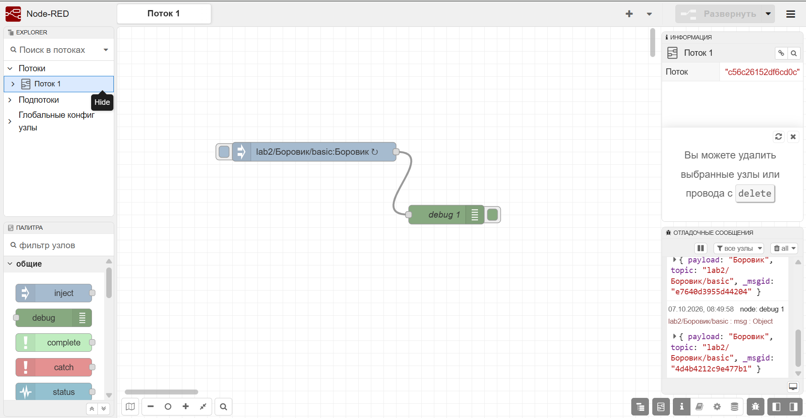

### 2.2. Function node

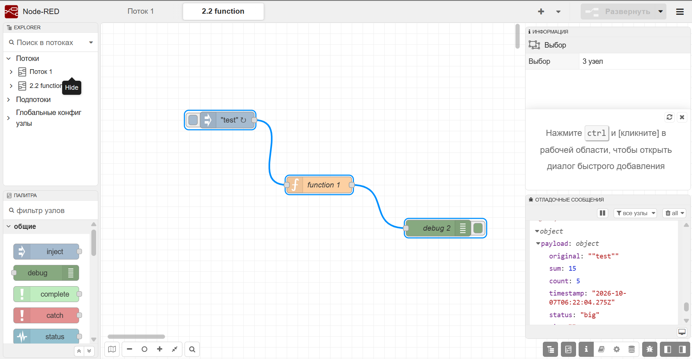

### 2.3. Switch node

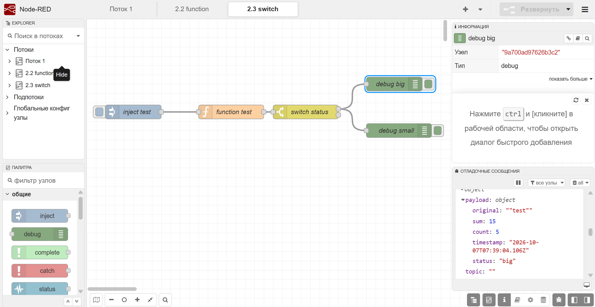

### 2.4. Change node

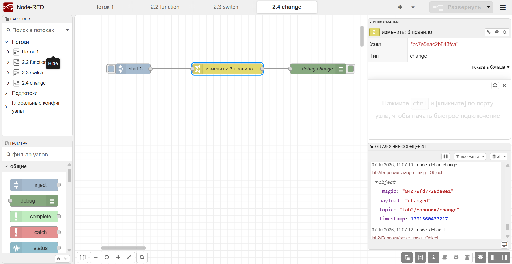

### 2.5. Template node

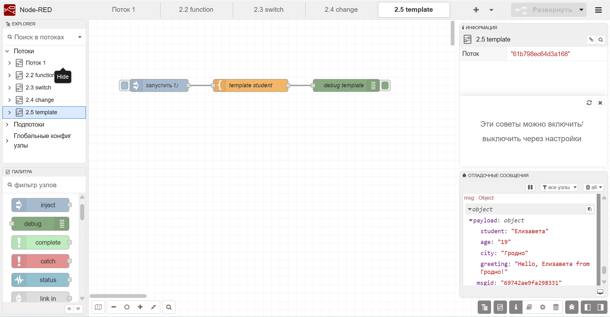

### 2.6. HTTP Request

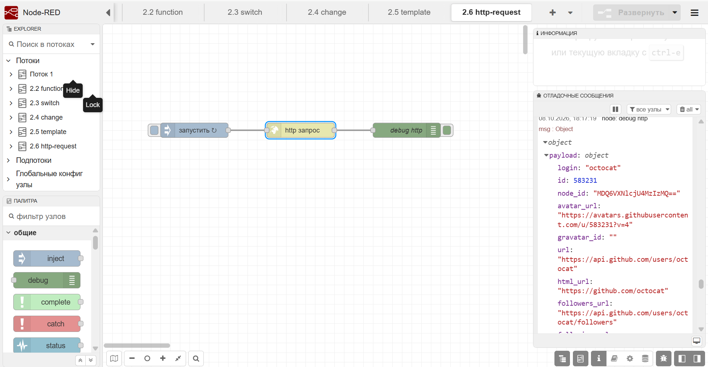

### 2.7. MQTT

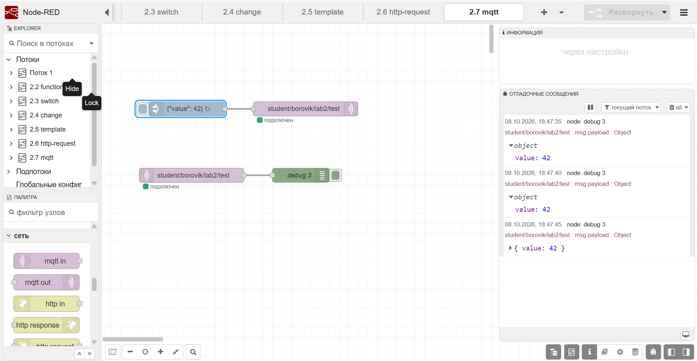

### 2.8. GET-эндпоинты

**Поток:**

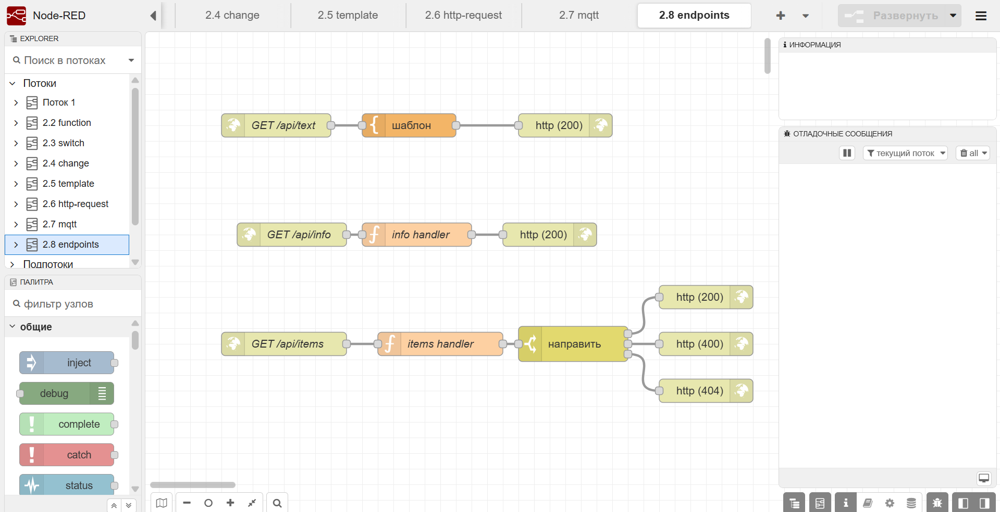

**Браузер — /api/text:**

**Браузер — /api/info:**

**Браузер — /api/items/1 (200):**

**Браузер — /api/items/999 (404):**

### 2.9. Dashboard

**Dashboard (gauge + chart):**

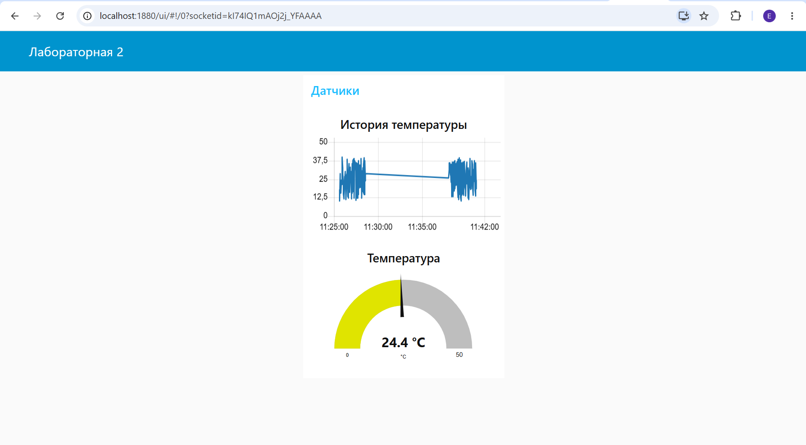

**Поток:**

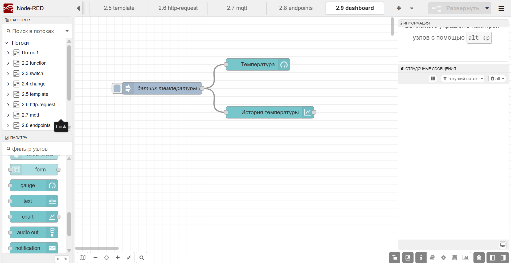

### 2.10. Telegram-бот

**Чат с ботом:**

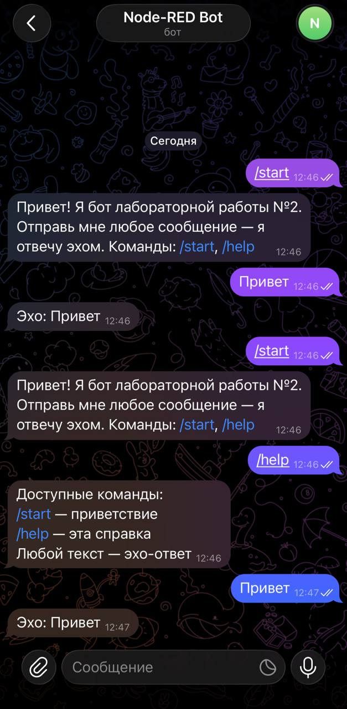

**Поток:**

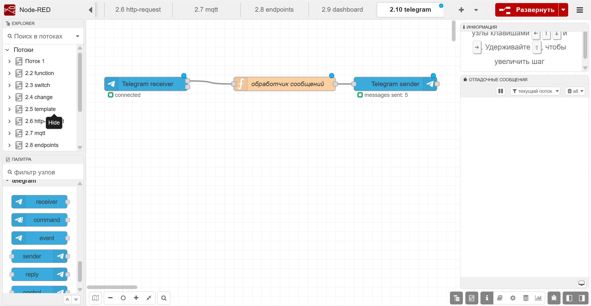

### 2.11. Чтение и запись файла

**Поток:**

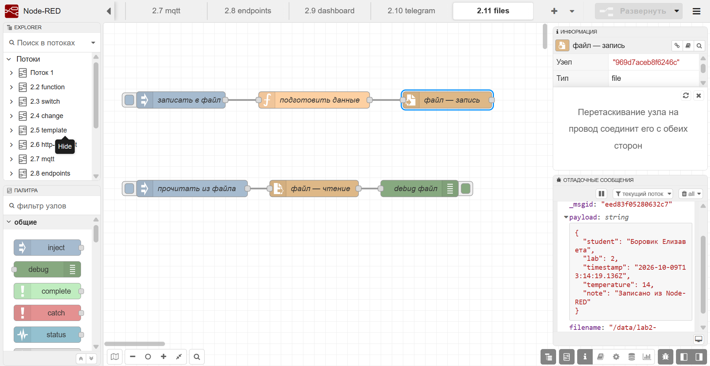

**После перезапуска (данные сохранились):**

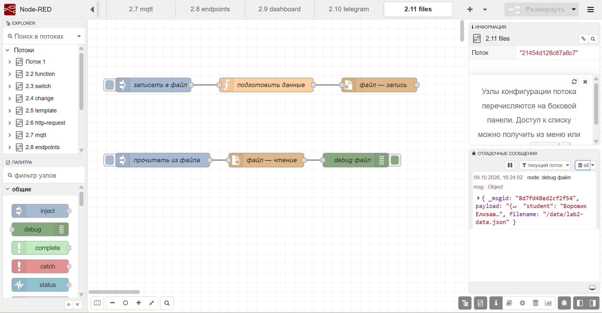

### 2.12. Работа с контекстом

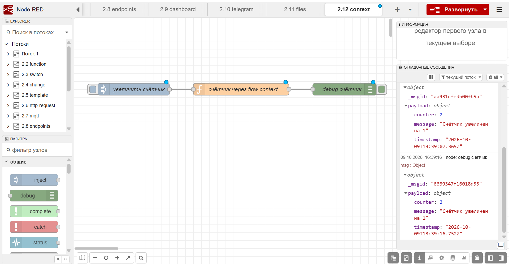

## 6. Выводы

В ходе лабораторной работы я освоила Node-RED как low-code инструмент для визуального программирования. Основные результаты:

1. Поняла принцип работы визуального программирования: сборка потока из нод вместо написания кода «с нуля».

2. Освоила базовые ноды (inject, debug, function, switch, change, template), которые покрывают большинство типовых задач.

3. Научилась работать с внешними системами через HTTP-запросы, MQTT и Telegram API. Это открывает возможности интеграции с любыми сервисами.

4. Разобралась с REST API в Node-RED: создание эндпоинтов через http in / http response, обработка path-параметров и query-параметров, возврат разных статус-кодов.

5. Познакомилась с Dashboard — визуализация данных в реальном времени (gauge, chart).

6. Освоила работу с файлами и контекстом — сохранение состояния между сообщениями и между перезапусками.

**Основные сложности:**

- Настройка статус-кода 400/404 в http response — в текущей версии Node-RED не поддерживается динамическое значение msg.statusCode, поэтому использовался switch node с тремя отдельными http response.